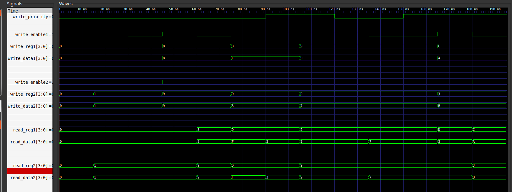

% CSE620, HDL Bonus Project (Register File)
% Abdullah Aml;2101398
% 

# Code structure 
All the codes are [[HERE]](https://github.com/Abdullahaml1/vhdl) on my github repository. project structure
```
register_file/
--- Makefile
--- register_file_test_bench.vhd
--- register_file.vhd
--- report
    --- export.sh
    --- out.pdf
    --- report.md
--- results.txt
--- sim.png
--- sim.vcd
--- test_vectors.txt
--- work-obj93.cf
```

* `Makefile`: compile and run scripts
* `test_vector.txt`: a file to input values.
* `results.text`: results of the test bench.
* `register_file_test_bench.vhd`: test bench code.
* `sim.png` simulation screenshot.
* `sim.vcd` simulation data.

To compile register file 
```
make compile
```
To run testbench
```
make run
```
To run simulator
```
make sim
```


# Register File Features

* It has `write_priority` to choose which register to write if we are writing to the same register

* Register File forwarding: if read and write happen at same time, It writes then reads.

# Simple sketch 

# Code 

```vhdl
---------------------------------------------------------------------------
-- an n-bit address, m-bit word Register File with 2 reads and 2 writes
---------------------------------------------------------------------------


library ieee;
use ieee.std_logic_1164.all;
use ieee.numeric_std.all;


entity register_file is
  generic(n: positive:=5;
          m: positive:= 32);
  port(write_enable1, write_enable2, write_priority: in std_logic;
       read_reg1, read_reg2: in unsigned(n-1 downto 0);
       write_reg1, write_reg2: in unsigned(n-1 downto 0);
       write_data1, write_data2: in std_logic_vector(m-1 downto 0);
       read_data1, read_data2: out std_logic_vector(m-1 downto 0));
end entity register_file;


architecture rf of register_file is
begin

  rf_p: process(write_enable1, write_enable2, write_priority,
                read_reg1,read_reg2,
                write_reg1, write_reg2, write_data1, write_data2) is

    type DW is array (0 to 2**n -1) of std_logic_vector(m-1 downto 0);
    variable word: DW;
  begin

    -- corner case writing in same register
    if (write_enable1 = '1' and write_enable2 = '1') and
      (write_reg1 = write_reg2) then

      -- choose write_reg2
      if write_priority = '1' then
        word(to_integer(write_reg2)) := write_data2;

      -- choose write_reg1
      else
        word(to_integer(write_reg1)) := write_data1;
      end if;

    -- normal case different registers
    else

      -- write_reg1
      if write_enable1 = '1' then
        word(to_integer(write_reg1)) := write_data1;
      end if;


      -- write_reg2
      if write_enable2 = '1' then
        word(to_integer(write_reg2)) := write_data2;
      end if;

    end if; -- write

    -- reading registers (register file forwarding)
    read_data1 <= word(to_integer(read_reg1));
    read_data2 <= word(to_integer(read_reg2));


  end process rf_p;
end architecture rf;

```


# Test Strategy 

| w1 | w2 | p | Rreg1 | Rreg2 | wreg1 | wreg2 | wdata1 | wdata2 | rdata1 | rdata2 | comment                                    |
|----+----+---+-------+-------+-------+-------+--------+--------+--------+--------+--------------------------------------------|
|  1 |  1 | 0 |  0000 |  0001 |  0000 |  0001 |   0000 |   0001 |   0000 |   0001 | initial (read and write at same location). |
|  0 |  0 | 0 |  0000 |  0001 |  0000 |  0001 |   0000 |   0001 |   0000 |   0001 | reading only.                              |
|  1 |  1 | 0 |  0000 |  0001 |  1000 |  1001 |   1000 |   1001 |   0000 |   0001 | read and write at different regs.          |
|  0 |  0 | 0 |  1000 |  1001 |  1000 |  1001 |   1000 |   1001 |   1000 |   1001 | read only.                                 |
|  1 |  1 | 0 |  1101 |  1101 |  1101 |  1101 |   1111 |   0011 |   1111 |   1111 | read write same reg (priority for reg1).   |
|  1 |  1 | 1 |  1101 |  1101 |  1101 |  1101 |   1111 |   0011 |   0011 |   0011 | read write same reg (priority for reg2).   |
|  1 |  0 | 1 |  1001 |  1001 |  1001 |  1001 |   1001 |   0111 |   1001 |   1001 | priority for reg2 with w2 disabled.        |
|  1 |  0 | 0 |  1001 |  1001 |  1001 |  1001 |   1001 |   0111 |   1001 |   1001 | priority for reg1 with w2 disabled.        |
|  0 |  1 | 0 |  1001 |  1001 |  1001 |  1001 |   1001 |   0111 |   0111 |   0111 | priority for reg1 with w1 disabled.        |
|  0 |  1 | 1 |  1001 |  1001 |  1001 |  1001 |   1001 |   0111 |   0111 |   0111 | priority for reg2 with w1 disabled.        |
|  1 |  1 | 1 |  1101 |  1001 |  1100 |  0011 |   1010 |   1011 |   0011 |   0111 | read write all different regs.             |
|  0 |  0 | 1 |  1100 |  0011 |  1100 |  0011 |   1010 |   1011 |   1010 |   1011 | verify last write.                         |


# Test Output

```
Time is now: 30 ns, write_enable1=1, write_enable2=1, write_priority=0,
read_reg1=0000, read_reg2=0001,
write_reg1=0000, write_reg2=0001, write_data1=0000, write_data2=0001,
actual read_data1=0000, actual read_data2=0001, read_data1=0000, read_data2=0001 Test PASSED

Time is now: 45 ns, write_enable1=0, write_enable2=0, write_priority=0,
read_reg1=0000, read_reg2=0001,
write_reg1=0000, write_reg2=0001, write_data1=0000, write_data2=0001,
actual read_data1=0000, actual read_data2=0001, read_data1=0000, read_data2=0001 Test PASSED

Time is now: 60 ns, write_enable1=1, write_enable2=1, write_priority=0,
read_reg1=0000, read_reg2=0001,
write_reg1=1000, write_reg2=1001, write_data1=1000, write_data2=1001,
actual read_data1=0000, actual read_data2=0001, read_data1=0000, read_data2=0001 Test PASSED

Time is now: 75 ns, write_enable1=0, write_enable2=0, write_priority=0,
read_reg1=1000, read_reg2=1001,
write_reg1=1000, write_reg2=1001, write_data1=1000, write_data2=1001,
actual read_data1=1000, actual read_data2=1001, read_data1=1000, read_data2=1001 Test PASSED

Time is now: 90 ns, write_enable1=1, write_enable2=1, write_priority=0,
read_reg1=1101, read_reg2=1101,
write_reg1=1101, write_reg2=1101, write_data1=1111, write_data2=0011,
actual read_data1=1111, actual read_data2=1111, read_data1=1111, read_data2=1111 Test PASSED

Time is now: 105 ns, write_enable1=1, write_enable2=1, write_priority=1,
read_reg1=1101, read_reg2=1101,
write_reg1=1101, write_reg2=1101, write_data1=1111, write_data2=0011,
actual read_data1=0011, actual read_data2=0011, read_data1=0011, read_data2=0011 Test PASSED

Time is now: 120 ns, write_enable1=1, write_enable2=0, write_priority=1,
read_reg1=1001, read_reg2=1001,
write_reg1=1001, write_reg2=1001, write_data1=1001, write_data2=0111,
actual read_data1=1001, actual read_data2=1001, read_data1=1001, read_data2=1001 Test PASSED

Time is now: 135 ns, write_enable1=1, write_enable2=0, write_priority=0,
read_reg1=1001, read_reg2=1001,
write_reg1=1001, write_reg2=1001, write_data1=1001, write_data2=0111,
actual read_data1=1001, actual read_data2=1001, read_data1=1001, read_data2=1001 Test PASSED

Time is now: 150 ns, write_enable1=0, write_enable2=1, write_priority=0,
read_reg1=1001, read_reg2=1001,
write_reg1=1001, write_reg2=1001, write_data1=1001, write_data2=0111,
actual read_data1=0111, actual read_data2=0111, read_data1=0111, read_data2=0111 Test PASSED

Time is now: 165 ns, write_enable1=0, write_enable2=1, write_priority=1,
read_reg1=1001, read_reg2=1001,
write_reg1=1001, write_reg2=1001, write_data1=1001, write_data2=0111,
actual read_data1=0111, actual read_data2=0111, read_data1=0111, read_data2=0111 Test PASSED

Time is now: 180 ns, write_enable1=1, write_enable2=1, write_priority=1,
read_reg1=1101, read_reg2=1001,
write_reg1=1100, write_reg2=0011, write_data1=1010, write_data2=1011,
actual read_data1=0011, actual read_data2=0111, read_data1=0011, read_data2=0111 Test PASSED

Time is now: 195 ns, write_enable1=0, write_enable2=0, write_priority=1,
read_reg1=1100, read_reg2=0011,
write_reg1=1100, write_reg2=0011, write_data1=1010, write_data2=1011,
actual read_data1=1010, actual read_data2=1011, read_data1=1010, read_data2=1011 Test PASSED

```

# Test Bench Simulation



# Tools

* [[GHDL]](https://ghdl.github.io/ghdl/): Free and open-source analyzer, compiler, simulator and (experimental) synthesizer for VHDL 
* [[gtkwave]](https://github.com/gtkwave/gtkwave): An open source simulation viewer.
* Makefile: script automation tool fro development.
* [[github]](https://github.com/): source control platform.
* [[spacemacs]](https://www.spacemacs.org/): coding text editor.
* [[pandoc]](https://pandoc.org/): A file converter and styling. I wrote the report in Markdown language ant it generates the styles for the report automatic.

# Resource

* [[print string to file]](https://stackoverflow.com/questions/24329155/is-there-a-way-to-print-the-values-of-a-signal-to-a-file-from-a-modelsim-simulat)


