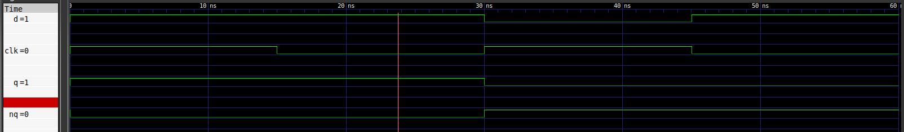
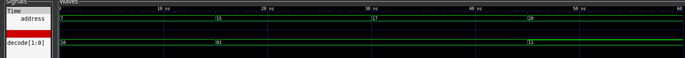
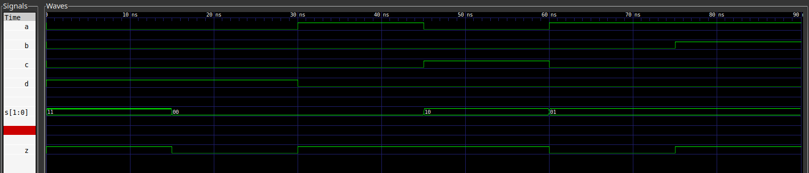
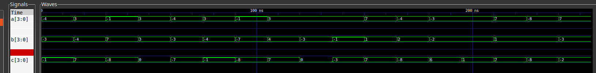
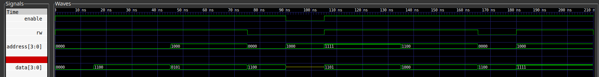
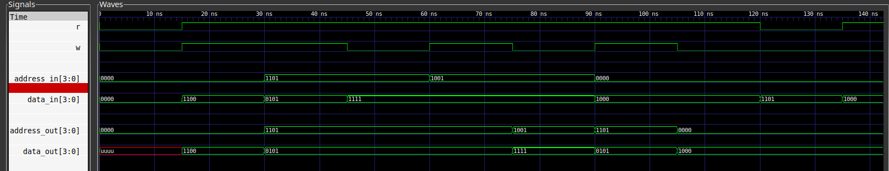
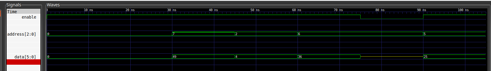
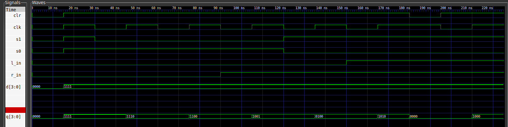
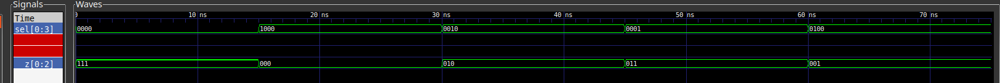
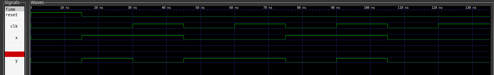

% CSE620, HDL Project
% Abdullah Aml;2101398
% 

# Overview 
All the code is [[HERE]](https://github.com/Abdullahaml1/vhdl) on my github repository. Every file on the repository contains the following:
```
ram_dual_port/
-- Makefile
-- ram_dual_port_test_bench.vhd
-- ram_dual_port.vhd
-- results.txt
-- sim.png
-- sim.vcd
-- test_vectors.txt
-- work-obj93.cf
```

* `Makefile`: compile and run scripts
* `test_vector.txt`: a file to input values.
* `results.text`: results of the test bench.
* `xxx_test_bench.vhd`: test bench code.
* `sim.png` simulation screenshot.
* `sim.vcd` simulation data.


# 1-Bit Latch

## Test Strategy
| D | Clk | q | qbar | comment                                 |
|---+-----+---+------+-----------------------------------------|
| 1 |   1 | 1 |    0 | problem reacting to change in D         |
| 1 |   0 | 1 |    0 | The latch does not hold D               |
| 0 |   1 | 0 |    1 | Deasserting D (do latch depend on clk?) |
| 1 |   0 | 0 |    1 | output is not changing at the clock     |

## Test Output
```
Time is now: 15 ns, D=1, clk=1, Actual q=1, Actual nq=0 Test PASSED
Time is now: 30 ns, D=1, clk=0, Actual q=1, Actual nq=0 Test PASSED
Time is now: 45 ns, D=0, clk=1, Actual q=0, Actual nq=1 Test PASSED
Time is now: 60 ns, D=1, clk=0, Actual q=0, Actual nq=1 Test PASSED
```

{#bit-latch}


# Address Decoder 2

## Test Strategy
| address | decode | comment                                             |
|---------+--------+-----------------------------------------------------|
|       7 |     10 | Corner case for first case.                         |
|      15 |     01 | Corner case for second case (changing both bits).   |
|      17 |     01 | does save the output(out side the range behaviour). |
|      20 |     11 | problem reacting to change in D.                    |


## Test Output
```
Time is now: 15 ns, address=7, decode=10, Actual decode=10 Test PASSED
Time is now: 30 ns, address=15, decode=01, Actual decode=01 Test PASSED
Time is now: 45 ns, address=17, decode=01, Actual decode=01 Test PASSED
Time is now: 60 ns, address=20, decode=11, Actual decode=11 Test PASSED
```

{#decoder_2}

# Mux

## Test Strategy
| abcd |  s | z | comment                       |
|------+----+---+-------------------------------|
| 0001 | 11 | 1 | Not selecting the last input. |
| 0001 | 00 | 0 | stuck at 1 output.            |
| 1000 | 00 | 1 | not selecting first input.    |
| 0010 | 10 | 1 | Not selecting third input.    |
| 1000 | 01 | 0 | stuck at 1 fault.             |
| 1100 | 01 | 1 | Not selecting second input.   |

## Test Output
```
Time is now: 15 ns, a,b,c,d=0001, s=11, z=1, Actual z=1 Test PASSED
Time is now: 30 ns, a,b,c,d=0001, s=00, z=0, Actual z=0 Test PASSED
Time is now: 45 ns, a,b,c,d=1000, s=00, z=1, Actual z=1 Test PASSED
Time is now: 60 ns, a,b,c,d=0010, s=10, z=1, Actual z=1 Test PASSED
Time is now: 75 ns, a,b,c,d=1000, s=01, z=0, Actual z=0 Test PASSED
Time is now: 90 ns, a,b,c,d=1100, s=01, z=1, Actual z=1 Test PASSED
```

{#mux}

# ALU

## Test Strategy
| op |    a |    b |    c | comment                        |
|----+------+------+------+--------------------------------|
| 01 | 1100 | 1101 | 1111 | all ones test.                 |
| 01 | 0011 | 1100 | 0111 | maximum range(positive) of c.  |
| 01 | 1111 | 0111 | 1000 | maximum range (negative )of c. |
| 01 | 0011 | 0011 | 0000 | getting zero output.           |
| 00 | 1100 | 1101 | 1001 | random test.                   |
| 00 | 0011 | 1100 | 1111 | all ones test of c.            |
| 00 | 1111 | 1001 | 1000 | maximum range (negative )of c. |
| 00 | 0011 | 0100 | 0111 | maximum range(positive) of c.  |
| 00 | 0011 | 1101 | 0000 | getting zero output.           |
| 10 | 0011 | 1111 | 1101 | not changing op.               |
| 10 | 0111 | 0001 | 0111 | max range(positive).           |
| 10 | 1100 | 0010 | 1000 | max range(negative).           |
| 10 | 1101 | 1110 | 0110 | not considering sign.          |
| 11 | 1101 | 1110 | 0000 | not considering sign.          |
| 11 | 0111 | 0001 | 0111 | max range(positive).           |
| 11 | 1000 | 0001 | 1000 | max range(negative).           |
| 11 | 0111 | 1101 | 1110 | random example.                |

## Test output
```
time is now: 15 ns, op=sub, a=1100, b=1101, c=-1, actual c=1111 test passed
time is now: 30 ns, op=sub, a=0011, b=1100, c=7, actual c=0111 test passed
time is now: 45 ns, op=sub, a=1111, b=0111, c=-8, actual c=1000 test passed
time is now: 60 ns, op=sub, a=0011, b=0011, c=0, actual c=0000 test passed
time is now: 75 ns, op=add, a=1100, b=1101, c=-7, actual c=1001 test passed
time is now: 90 ns, op=add, a=0011, b=1100, c=-1, actual c=1111 test passed
time is now: 105 ns, op=add, a=1111, b=1001, c=-8, actual c=1000 test passed
time is now: 120 ns, op=add, a=0011, b=0100, c=7, actual c=0111 test passed
time is now: 135 ns, op=add, a=0011, b=1101, c=0, actual c=0000 test passed
time is now: 150 ns, op=mul, a=0011, b=1111, c=-3, actual c=1101 test passed
time is now: 165 ns, op=mul, a=0111, b=0001, c=7, actual c=0111 test passed
time is now: 180 ns, op=mul, a=1100, b=0010, c=-8, actual c=1000 test passed
time is now: 195 ns, op=mul, a=1101, b=1110, c=6, actual c=0110 test passed
time is now: 210 ns, op=div, a=1101, b=1110, c=1, actual c=0000 failed,
error messages:  not considering sign.
time is now: 225 ns, op=div, a=0111, b=0001, c=7, actual c=0111 test passed
time is now: 240 ns, op=div, a=1000, b=0001, c=-8, actual c=1000 test passed
time is now: 255 ns, op=div, a=0111, b=1101, c=-2, actual c=1110 test passed
```

{#alu}

# RAM single port

## Test strategy
| rw | enable | address | datain | dataout | comment                        |
|----+--------+---------+--------+---------+--------------------------------|
|  1 |      1 |    0000 |   1100 |    0000 | memory is not storing input.   |
|  0 |      1 |    0000 |   1100 |    1100 | memory is not storing input.   |
|  1 |      1 |    1000 |   0101 |    1100 | stuck at the previous output.  |
|  0 |      1 |    1000 |   0101 |    0101 | stuck at the previous output.  |
|  0 |      1 |    0000 |   1100 |    1100 | loses the stored data.         |
|  0 |      0 |    1000 |   0101 |    0101 | Enable is now working.         |
|  1 |      1 |    1111 |   1101 |    1100 | corner cases (last address).   |
|  0 |      1 |    1111 |   1101 |    1101 | corner cases (last address).   |
|  1 |      1 |    1100 |   1000 |    1000 | corner cases (middle address). |
|  0 |      1 |    1100 |   1000 |    1000 | corner cases (middle address). |
|  0 |      1 |    0000 |   1100 |    1100 | Not storing previous data.     |
|  1 |      1 |    1000 |   1111 |    1111 | Not accepting new data.        |
|  0 |      1 |    1000 |   1111 |    1111 | Not accepting new data.        |


## Test Output
```
Time is now: 30 ns, rw=1, enable=1, address=0000, write_data_in=1100,
read_data_out=0000, memory data=1100
Time is now: 45 ns, rw=0, enable=1, address=0000, write_data_in=1100,
read_data_out=1100, memory data=1100 Test PASSED
Time is now: 60 ns, rw=1, enable=1, address=1000, write_data_in=0101,
read_data_out=1100, memory data=0101
Time is now: 75 ns, rw=0, enable=1, address=1000, write_data_in=0101,
read_data_out=0101, memory data=0101 Test PASSED
Time is now: 90 ns, rw=0, enable=1, address=0000, write_data_in=1100,
read_data_out=1100, memory data=1100 Test PASSED
Time is now: 105 ns, rw=0, enable=0, address=1000, write_data_in=0101,
read_data_out=0101, memory data=ZZZZ Test PASSED 
Time is now: 120 ns, rw=1, enable=1, address=1111, write_data_in=1101,
read_data_out=1100, memory data=1101
Time is now: 135 ns, rw=0, enable=1, address=1111, write_data_in=1101,
read_data_out=1101, memory data=1101 Test PASSED
Time is now: 150 ns, rw=1, enable=1, address=1100, write_data_in=1000
, read_data_out=1000, memory data=1000
Time is now: 165 ns, rw=0, enable=1, address=1100, write_data_in=1000,
read_data_out=1000, memory data=1000 Test PASSED
Time is now: 180 ns, rw=0, enable=1, address=0000, write_data_in=1100,
read_data_out=1100, memory data=1100 Test PASSED
Time is now: 195 ns, rw=1, enable=1, address=1000, write_data_in=1111,
read_data_out=1111, memory data=1111
Time is now: 210 ns, rw=0, enable=1, address=1000, write_data_in=1111,
read_data_out=1111, memory data=1111 Test PASSED

```


{#ram_single_port}


# Ram Dual Port

## Test Strategy

| r | w | address_in | address_out | data_in | data_out |                                                     |
|---+---+------------+-------------+---------+----------+-----------------------------------------------------|
| 1 | 1 |       0000 |        0000 |    1100 |     1100 | Reading and writing at the same time.               |
| 1 | 1 |       1101 |        1101 |    0101 |     0101 | Reading and writing at the same time.               |
| 1 | 0 |       1101 |        1101 |    1111 |     0101 | writing when ever address is valid.                 |
| 1 | 1 |       1001 |        1101 |    1111 |     0101 | writing and reading in different locations.         |
| 1 | 0 |       1001 |        1001 |    1111 |     1111 | Reading the previous location.                      |
| 1 | 1 |       0000 |        1101 |    1000 |     0101 | Not accepting multiple writes to the same location. |
| 1 | 0 |       0000 |        0000 |    1000 |     1000 | Not accepting multiple writes to the same location. |
| 0 | 0 |       0000 |        0000 |    1101 |     1000 | read and write stuck at 0.                          |
| 1 | 0 |       0000 |        0000 |    1000 |     1000 | read and write stuck at 0.                          |


## Test Output

```
Time is now: 30 ns, r=1, w=1, address_in=0000, address_out=0000,
data_in=1100, data_out=1100 Test PASSED
Time is now: 45 ns, r=1, w=1, address_in=1101, address_out=1101,
data_in=0101, data_out=0101 Test PASSED
Time is now: 60 ns, r=1, w=0, address_in=1101, address_out=1101,
data_in=1111, data_out=0101 Test PASSED
Time is now: 75 ns, r=1, w=1, address_in=1001, address_out=1101,
data_in=1111, data_out=0101 Test PASSED
Time is now: 90 ns, r=1, w=0, address_in=1001, address_out=1001,
data_in=1111, data_out=1111 Test PASSED
Time is now: 105 ns, r=1, w=1, address_in=0000, address_out=1101,
data_in=1000, data_out=0101 Test PASSED
Time is now: 120 ns, r=1, w=0, address_in=0000, address_out=0000,
data_in=1000, data_out=1000 Test PASSED
Time is now: 135 ns, r=0, w=0, address_in=0000, address_out=0000,
data_in=1101, data_out=1000 Test PASSED
Time is now: 150 ns, r=1, w=0, address_in=0000, address_out=0000,
data_in=1000, data_out=1000 Test PASSED
```


{#ram_dual_port}


# ROM

## Test strategy 

| enable | address |   data | comment                          |
|--------+---------+--------+----------------------------------|
|      1 |     000 | 000000 | initial value.                   |
|      1 |     111 | 110001 | data stuck at 0.                 |
|      1 |     010 | 000100 | data stuck at 1.                 |
|      1 |     110 | 100100 | Random test.                     |
|      0 |     110 | 100100 | disable the rom destroys data.   |
|      1 |     101 | 011001 | ROM is now working after enable. |


## Test Output

```
Time is now: 30 ns, enable=1, address=000, Actual data=000000, data=000000 Test PASSED
Time is now: 45 ns, enable=1, address=111, Actual data=110001, data=110001 Test PASSED
Time is now: 60 ns, enable=1, address=010, Actual data=000100, data=000100 Test PASSED
Time is now: 75 ns, enable=1, address=110, Actual data=100100, data=100100 Test PASSED
Time is now: 90 ns, enable=0, address=110, Actual data=100100, data=ZZZZZZ Test PASSED
Time is now: 105 ns, enable=1, address=101, Actual data=011001, data=011001 Test PASSED
```


{#rom}


# Shift Register

## Test strategy

| clk | clr | l_in | r_in | s0 | s1 |    d |    q | comment                       |
|-----+-----+------+------+----+----+------+------+-------------------------------|
|   1 |   1 |    0 |    0 |  1 |  1 | 1111 | 1111 | stuck at 0 output.            |
|   0 |   1 |    0 |    0 |  1 |  0 | 1111 | 1111 | stuck at 1 output.            |
|   1 |   1 |    0 |    0 |  1 |  0 | 1111 | 1110 | stuck at 1 output.            |
|   0 |   1 |    0 |    0 |  1 |  0 | 1111 | 1110 | Not shifting left.            |
|   1 |   1 |    0 |    0 |  1 |  0 | 1111 | 1100 | Not shifting left.            |
|   0 |   1 |    0 |    1 |  1 |  0 | 1111 | 1100 | r_in stuck at 0.              |
|   1 |   1 |    0 |    1 |  1 |  0 | 1111 | 1001 | r_in stuck at 0.              |
|   0 |   1 |    0 |    1 |  0 |  1 | 1111 | 1001 | stuck at shifting left state. |
|   1 |   1 |    0 |    1 |  0 |  1 | 1111 | 0100 | stuck at shifting left state. |
|   0 |   1 |    1 |    1 |  0 |  1 | 1111 | 0100 | l_in stuck at 0.              |
|   1 |   1 |    1 |    1 |  0 |  1 | 1111 | 1010 | l_in stuck at 0.              |
|   1 |   0 |    1 |    1 |  0 |  1 | 1111 | 0000 | Not clearing the output.      |
|   0 |   1 |    1 |    1 |  0 |  1 | 1111 | 0000 | random test after clear.      |
|   1 |   1 |    1 |    1 |  0 |  1 | 1111 | 1000 | random test after clear.      |


## Test output

```
Time is now: 30 ns, clk=1, clr=1, l_in=0, r_in=0, s0=1, s1=1, d=1111, Actual q=1111
, q=1111 Test PASSED
Time is now: 45 ns, clk=0, clr=1, l_in=0, r_in=0, s0=1, s1=0, d=1111, Actual q=1111,
q=1111 Test PASSED
Time is now: 60 ns, clk=1, clr=1, l_in=0, r_in=0, s0=1, s1=0, d=1111, Actual q=1110,
q=1110 Test PASSED
Time is now: 75 ns, clk=0, clr=1, l_in=0, r_in=0, s0=1, s1=0, d=1111, Actual q=1110,
q=1110 Test PASSED
Time is now: 90 ns, clk=1, clr=1, l_in=0, r_in=0, s0=1, s1=0, d=1111, Actual q=1100,
q=1100 Test PASSED
Time is now: 105 ns, clk=0, clr=1, l_in=0, r_in=1, s0=1, s1=0, d=1111, Actual q=1100,
q=1100 Test PASSED
Time is now: 120 ns, clk=1, clr=1, l_in=0, r_in=1, s0=1, s1=0, d=1111, Actual q=1001,
q=1001 Test PASSED
Time is now: 135 ns, clk=0, clr=1, l_in=0, r_in=1, s0=0, s1=1, d=1111, Actual q=1001,
q=1001 Test PASSED
Time is now: 150 ns, clk=1, clr=1, l_in=0, r_in=1, s0=0, s1=1, d=1111, Actual q=0100,
q=0100 Test PASSED
Time is now: 165 ns, clk=0, clr=1, l_in=1, r_in=1, s0=0, s1=1, d=1111, Actual q=0100,
q=0100 Test PASSED
Time is now: 180 ns, clk=1, clr=1, l_in=1, r_in=1, s0=0, s1=1, d=1111, Actual q=1010,
q=1010 Test PASSED
Time is now: 195 ns, clk=1, clr=0, l_in=1, r_in=1, s0=0, s1=1, d=1111, Actual q=0000,
q=0000 Test PASSED
Time is now: 210 ns, clk=0, clr=1, l_in=1, r_in=1, s0=0, s1=1, d=1111, Actual q=0000,
q=0000 Test PASSED
Time is now: 225 ns, clk=1, clr=1, l_in=1, r_in=1, s0=0, s1=1, d=1111, Actual q=1000,
q=1000 Test PASSED
```

{#shift_register}


# Priority Encoder

## Test strategy

|  sel |   z | comment                   |
|------+-----+---------------------------|
| 1000 | 000 | stuck at 1 output.        |
| 0010 | 010 | not responding for input. |
| 0001 | 011 | corner case.              |
| 0100 | 001 | corner case.              |


## Test Output

```
Time is now: 30 ns, sel=1000, Actual z=000, z=000 Test PASSED
Time is now: 45 ns, sel=0010, Actual z=010, z=010 Test PASSED
Time is now: 60 ns, sel=0001, Actual z=011, z=011 Test PASSED
Time is now: 75 ns, sel=0100, Actual z=001, z=001 Test PASSED
```

{#priority}


# FSM Mealy 2p


# Test strategy

| clk | reset | x | y | comment          |
|-----+-------+---+---+------------------|
|   0 |     0 | 1 | 1 | to odd state.    |
|   1 |     0 | 1 | 0 | to odd state.    |
|   0 |     0 | 0 | 1 | staying at odd.  |
|   1 |     0 | 0 | 1 | staying at odd.  |
|   0 |     0 | 1 | 0 | going to even.   |
|   1 |     0 | 1 | 1 | going to even.   |
|   0 |     0 | 0 | 0 | staying in even. |
|   1 |     0 | 0 | 0 | staying in even. |


## Test output


```
Time is now: 30 ns, reset=0, clk=0, x=1, Actual y=1, y=1 Test PASSED
Time is now: 45 ns, reset=0, clk=1, x=1, Actual y=0, y=0 Test PASSED
Time is now: 60 ns, reset=0, clk=0, x=0, Actual y=1, y=1 Test PASSED
Time is now: 75 ns, reset=0, clk=1, x=0, Actual y=1, y=1 Test PASSED
Time is now: 90 ns, reset=0, clk=0, x=1, Actual y=0, y=0 Test PASSED
Time is now: 105 ns, reset=0, clk=1, x=1, Actual y=1, y=1 Test PASSED
Time is now: 120 ns, reset=0, clk=0, x=0, Actual y=0, y=0 Test PASSED
Time is now: 135 ns, reset=0, clk=1, x=0, Actual y=0, y=0 Test PASSED
```


{#fsm_mealy_2p}

# Tools

* [[GHDL]](https://ghdl.github.io/ghdl/): Free and open-source analyzer, compiler, simulator and (experimental) synthesizer for VHDL 
* [[gtkwave]](https://github.com/gtkwave/gtkwave): An open source simulation viewer.
* Makefile: script automation tool fro development.
* [[github]](https://github.com/): source control platform.
* [[spacemacs]](https://www.spacemacs.org/): coding text editor.
* [[pandoc]](https://pandoc.org/): A file converter and styling. I wrote the report in Markdown language ant it generates the styles for the report automatic.

# Resource

* [[print string to file]](https://stackoverflow.com/questions/24329155/is-there-a-way-to-print-the-values-of-a-signal-to-a-file-from-a-modelsim-simulat)


